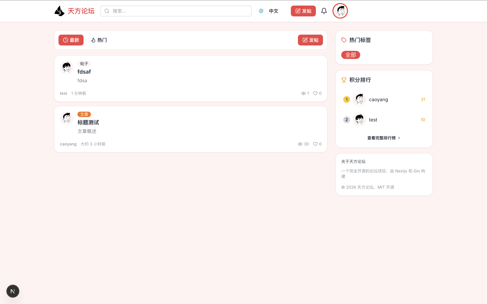
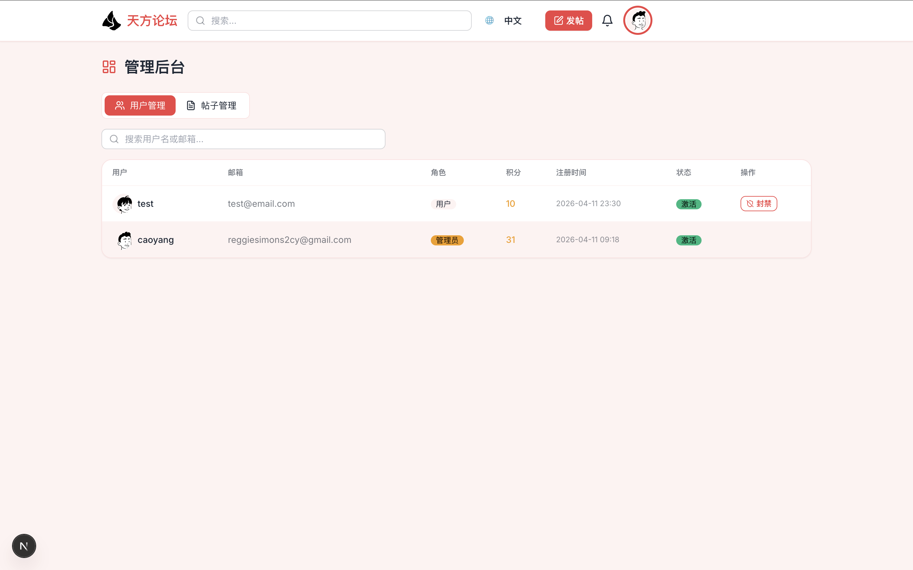
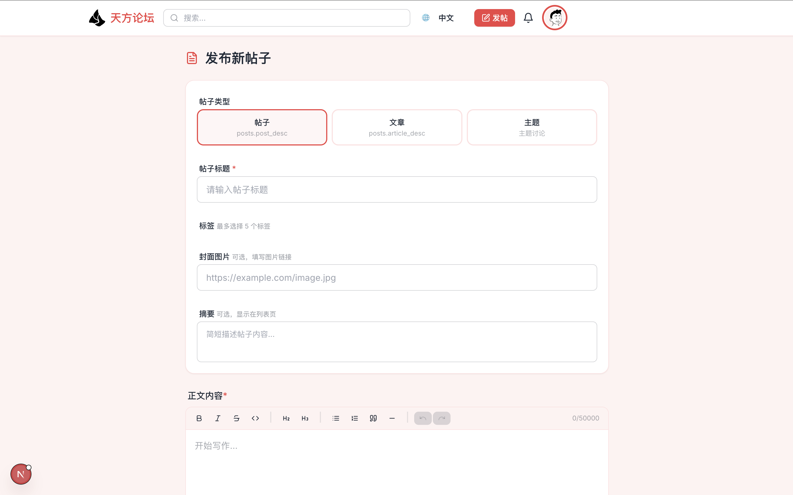
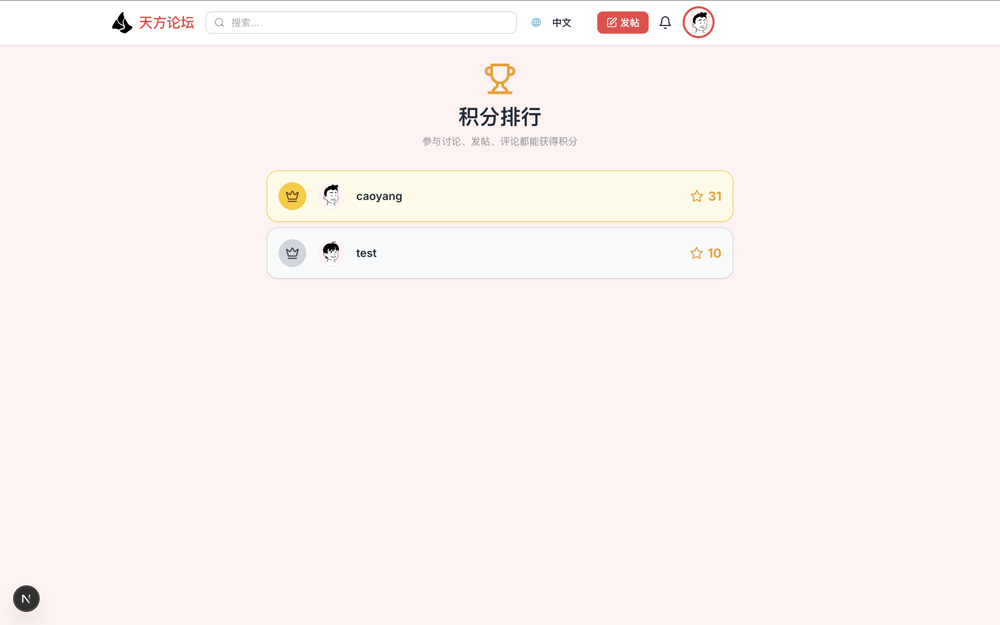
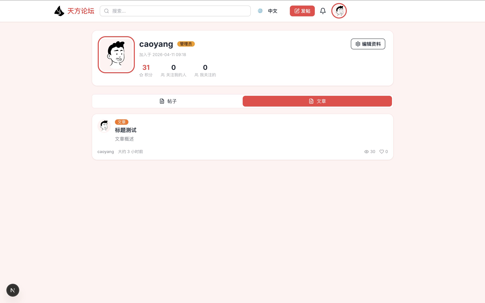

# Tiny Forum

> Go (Gin + GORM) 后端 × Next.js 15.5 (App Router) 前端 × PostgreSQL

<div align="center">
  
</div>

<summary>
Tiny Forum 是一个基于 Go 和 Next.js 的开源论坛项目，旨在提供一个简单、易用的社区平台。项目采用现代技术栈，包括 Gin、GORM、Next.js、PostgreSQL 等，为用户提供丰富的功能，包括帖子发布、评论、点赞、标签系统、用户管理等。
<details>
主页
  
  后台管理
  
  发布文章
  
  积分排行
  
  用户中心
  
</details>
</summary>

## 创建超级管理员
```bash

```

---

## 技术栈

| 层 | 技术 |
|---|---|
| 后端 | Go 1.26, Gin, GORM, Wire (手动注入), JWT, Zap |
| 前端 | Next.js 16, TypeScript, Tailwind CSS, DaisyUI, TanStack Query, Zustand, Tiptap |
| 数据库 | PostgreSQL 16, Redis |
| 部署 | Docker + Docker Compose |

## 功能列表

- ✅ 用户注册 / 登录 / JWT 鉴权
- ✅ 发帖（帖子 / 文章 / 话题）、富文本编辑器
- ✅ 评论 & 嵌套回复
- ✅ 点赞 / 取消点赞
- ✅ 标签系统
- ✅ 关注 / 取消关注
- ✅ 积分系统 & 排行榜
- ✅ 站内消息通知
- ✅ 个人主页 / 编辑资料
- ✅ 管理后台（用户管理、封禁、置顶）
- ✅ 全文搜索（标题 & 内容）
- ✅ 风控（内容合规、行为风控） 

# 已知 BUG
> 非重要业务问题，暂不修复
> (修复起来很简单，目前专注实现业务，暂不修复)
> 1. 页面翻译错乱
> 2. 导航 UI 重叠

## 用户信息
1. 注册：需要再次登陆（原因： auth.ts 以及后端的 cookie 没有发送/接收）
2. 通知：用户无法已读单个通知

## 问答
1. 提问页面：获取到问题后，点击跳转失败（原因：ID 查询问题，因为 question 实际上也是 post类型的一种，所以需要关联查询 post/id 到 question/post_id）

## 主页
1. 首页：页面统计信息不正确（原因：页面硬编码，未与数据库同步）

## 板块
1. 用户可以直接访问创建板块的页面（体验优化）

## 关于重置用户密码的说明
为了安全，是不应该直接重置用户密码为默认值的，因为用户不一定会更换密码，如果发生数据泄露，用户信息极易倍获取。考虑在生产环境中，使用邮箱获取临时密码，但是需要考虑用户操作一致性 / 安全性。

# 上游依赖

1. 敏感词： https://github.com/konsheng/Sensitive-lexicon