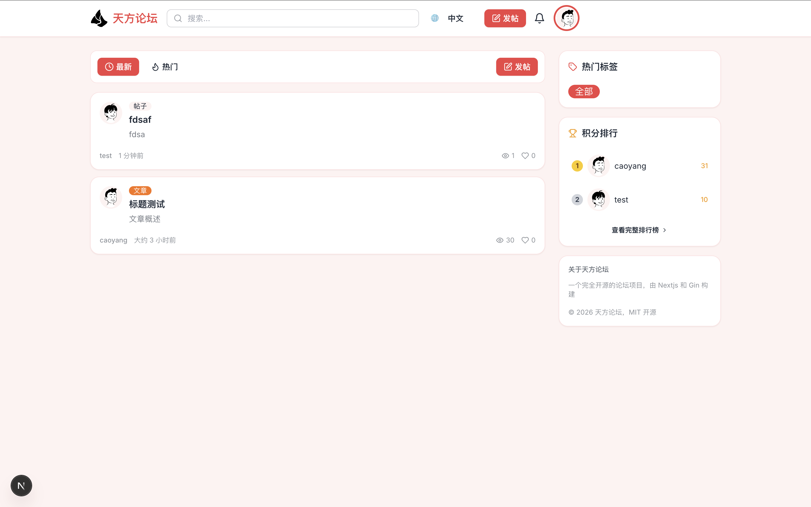
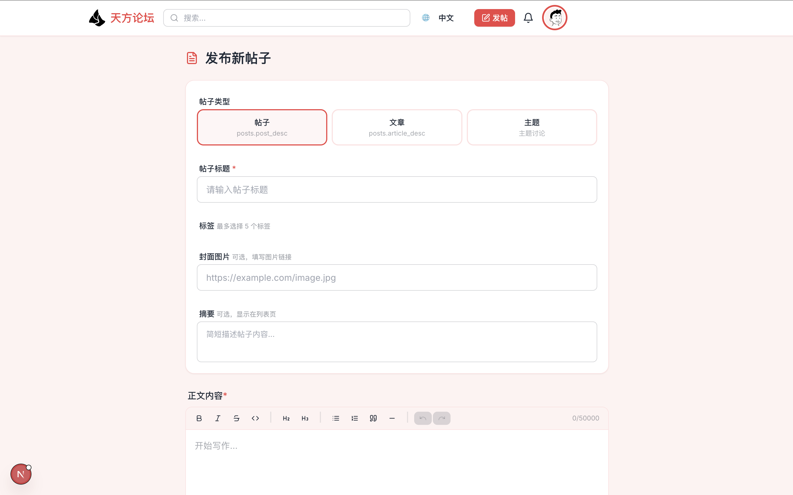
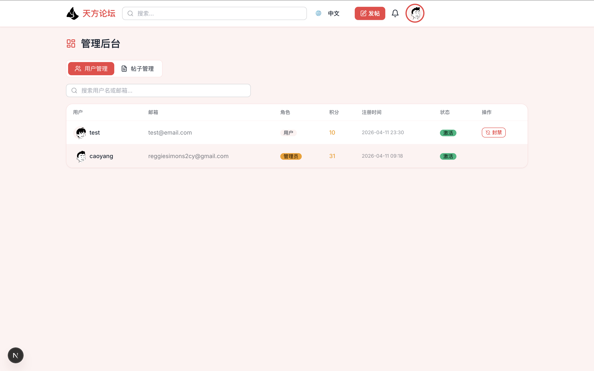
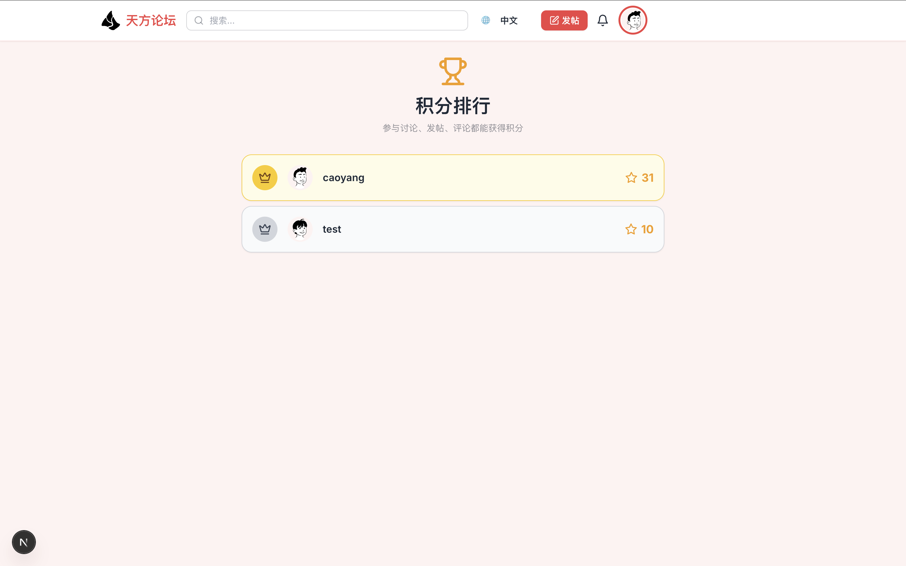

# Welcome to TinyForum Documentation

<p align="center">
  
</p>

## TinyForum 天方论坛

开源的现代化论坛系统 — Go 后端 + Next.js 前端，支持插件化和机器人自动化。

[中文文档](/zh-CN/README) | [English](/en/README) | [GitHub](https://github.com/caoyang2002/TinyForum)

---

## 快速导航

| 角色 | 推荐入口 |
|------|----------|
| **普通用户** | [功能介绍](/zh-CN/guide/intro) · [使用指南](/zh-CN/usage/basic) · [常见问题](/zh-CN/qa/qa) |
| **管理员** | [快速部署](/zh-CN/guide/quickstart) · [认证授权](/zh-CN/product/auth) · [社区审核](/zh-CN/product/review) |
| **开发者** | [开发手册](/zh-CN/dev/index) · [架构设计](/zh-CN/dev/architecture) · [API 规范](/zh-CN/dev/restful_api) |
| **插件开发者** | [插件系统](/zh-CN/dev/plugin) · [机器人系统](/zh-CN/dev/robot) |

---

## 技术栈

| 层级 | 技术 |
|------|------|
| 后端 | Go 1.24+ · Gin · GORM · PostgreSQL · Redis |
| 前端 | Next.js 16 · React 19 · TypeScript · TailwindCSS · DaisyUI |
| 鉴权 | JWT · Casbin RBAC |
| 部署 | Docker Compose · Nginx |

---

## 核心特性

- **多类型内容**：帖子、文章、问答、主题讨论
- **富文本编辑**：基于 Tiptap 的所见即所得编辑器
- **评论与互动**：嵌套评论、点赞、关注、时间线
- **权限体系**：超级管理员 → 管理员 → 版主 → 审核员 → 会员 → 用户 → 游客
- **内容安全**：DFA 敏感词 + LLM 语义复核双重保障
- **Bot 机器人**：Lua 脚本 + 零代码 Flow 引擎
- **插件系统**：前端动态插件加载
- **国际化**：中英文双语支持
- **API 文档**：Swagger 自动生成

---

## 快速体验

```bash
git clone https://github.com/caoyang2002/TinyForum.git
cd TinyForum
cp .env.example .env
docker compose up -d
```

浏览器打开 `http://localhost:8080`。

---

## 项目截图

| 首页 | 编辑器 | 管理后台 | 积分系统 |
|:---:|:---:|:---:|:---:|
|  |  |  |  |

---

## 许可证

本项目采用 [MIT License](https://github.com/caoyang2002/TinyForum/blob/main/LICENSE) 开源。

---

## 开发声明

本项目部分代码由 AI 辅助生成，人机协作完成。项目遵循严格的 [AGENTS.md](https://github.com/caoyang2002/TinyForum/blob/main/AGENTS.md) AI 协作规范，确保代码质量和安全性。
